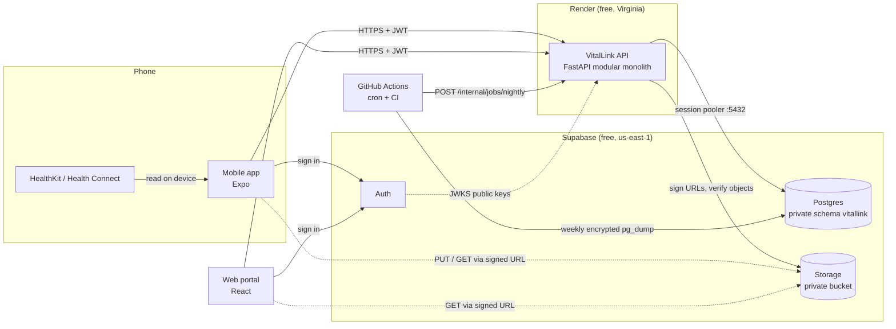
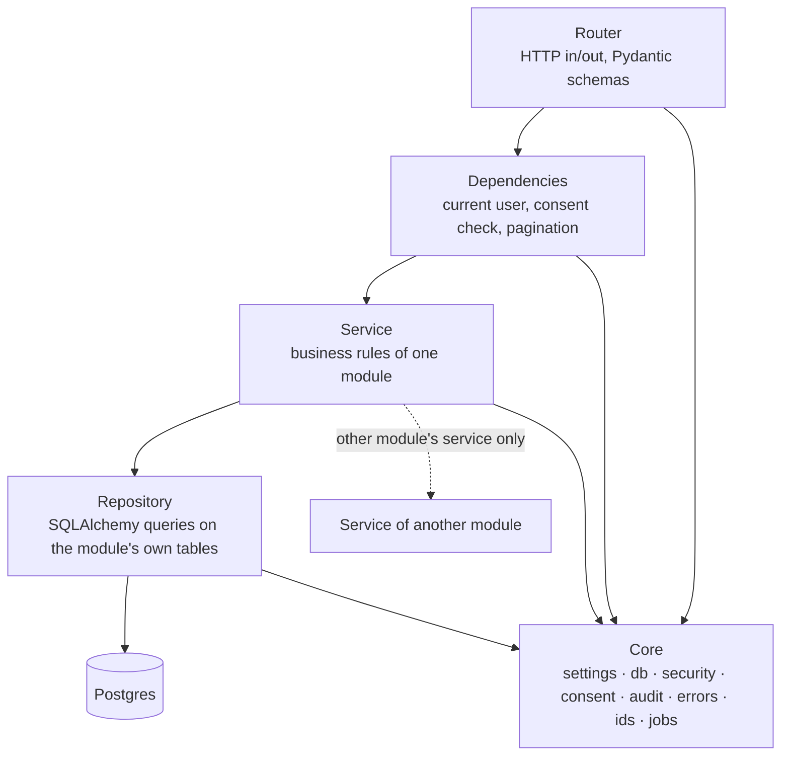

# 2. Architecture

## System context

- Clients sign in with Supabase Auth and send the access token on every API call.
- Only the API talks to Postgres. The Supabase Data API is switched off ([security](06-security-and-consent.md)).
- File bytes go straight between the client and Storage through signed URLs, never through the API.
- The web portal never syncs. HealthKit and Health Connect are reachable only on the phone.
- Medication and appointment **reminders are local notifications** scheduled on the phone. The
  server's notification feed is a list the user reads in the app. No push service is needed, and no
  health text reaches Apple, Google or Expo ([D9](10-open-decisions.md)).

## Why a modular monolith

One deployable service with strict internal boundaries. It fits the free tier (one web service),
a five-person team and simple debugging, and any module can be split out later. Microservices would
add network hops, multiple deploys and distributed transactions, and give nothing back at this scale.

## Layers inside the service

| Layer | Does | Never does |
|---|---|---|
| Router | Parse and validate the request, call one service, shape the response model | SQL, business rules |
| Dependencies | Resolve the caller from the JWT; run `require_scope(scope)` on shared routes | Load module data |
| Service | Rules of one module; transactions; calls other modules **through their service** | Touch another module's tables |
| Repository | Queries on the module's own tables, bound parameters only | Decide anything |
| Core | Shared infrastructure; knows no module | Import from a module |

An import-linter contract in CI enforces two things. A module may import only `core` and other
modules' `service` files. `core` may import no module.

## Modules

The design doc had 6 domain modules. The finished frontend needs 10: Records is split into
records and care, and sharing, notifications and library are new.

| Module | Responsibilities | Owns tables | Calls |
|---|---|---|---|
| **account** | User from token (insert-if-absent), profile, settings, targets, export, delete | `users`, `profiles` | every module's export/delete hooks |
| **health** | Metric catalogue, ingest + idempotency, series, summaries, dashboard, readiness, My Health tabs, devices, manual readings (mood, weight, BP) | `metrics`, `health_readings`, `ingest_batches`, `devices` | account (timezone, goals) |
| **training** | Exercise catalogue, workouts + sets, plans + planned sessions, weekly load, PRs, muscle-group sets | `exercises`, `workouts`, `exercise_sets`, `training_plans`, `plan_sessions` | health (HR zones, source label) |
| **nutrition** | Food search, meals with copied macros, hydration, targets, daily totals, burn estimate | `foods`, `meal_entries`, `meal_items`, `hydration_logs`, `nutrition_targets` | account (profile for BMR), health (active energy) |
| **goals** | Goals, per-period progress, status, streaks, consistency grid, nightly insights | `goals`, `goal_progress`, `insights` | health, training, nutrition (read totals) |
| **records** | Documents, signed upload/confirm/download, lab panels and results with previous value | `health_records`, `lab_panels`, `lab_results` | core storage |
| **care** | Medications, schedules, dose log, appointments, conditions/allergies, emergency profile + contacts | `medications`, `medication_schedules`, `dose_logs`, `appointments`, `conditions`, `emergency_profiles`, `emergency_contacts` | account (profile) |
| **sharing** | Create/list/revoke shares, shared-with-me, shared views, family view, access log | `consents`, `audit_log` (through core audit writer) | every module's read service, called with a scope |
| **notifications** | Feed, mark read, generation from events and the nightly job, retention | `notifications` | none (others call it) |
| **library** | Categories, featured, trending, article body; content seeded from Markdown in `seeds/library/` | `article_categories`, `articles`, `library_features` | none |

`messages` (clinician messaging) and `dependents` (child profiles) are **not modules** until
decisions D1 and D3 are made.

## Shared core

| Part | Job |
|---|---|
| `settings` | Every config value comes from env vars (pydantic-settings); nothing environment-specific in code |
| `db` | One async engine (pool 5 + 5 overflow); one transaction per request, committed on success, rolled back on error |
| `security` | Verify JWT signature, issuer, audience and expiry against Supabase JWKS (cached 10 min); read `email_verified` and `aal` (MFA) claims |
| `consent` | `decide()`, a pure function, plus `ConsentGate`, the wrapper that loads grants, decides, binds and audits |
| `audit` | `AuditWriter`, the only code that inserts into `audit_log`. It uses its own connection and transaction |
| `errors` | One error envelope `{"error": {code, message, detail, request_id}}`; exception → status mapping |
| `ids` | UUIDv7 generation (time-ordered keys index well) |
| `storage` | Supabase Storage client: sign upload/download, stat object, delete |
| `jobs` | Nightly runner: per-user steps, each in its own transaction, returns a summary |
| `ratelimit` | In-process per-user limits (60 ingest / 600 other per hour); valid only while one instance runs |

## Cross-cutting decisions

| Decision | Choice | Why |
|---|---|---|
| IDs | UUIDv7 for every exposed id; composite keys for `health_readings`; identity bigint for `audit_log` and `ingest_batches` | Not enumerable, and time-ordered for btree locality |
| Time | `timestamptz` UTC in the DB; user IANA timezone on `users`; day grouping in the user's zone | "Today" for a Dallas user runs midnight to midnight Central |
| Units | SI in the DB (m, kg, °C, ml); the API returns SI; view-models convert per `profiles.units` | Fixes the km vs miles mix noted in CLAUDE.md |
| Display strings | The API returns data, and `packages/api` view-models format it. Exceptions are fields the types already define as server text (`detail`, `assessment`, insight `text`) | Same contract as the mock |
| Enums | Postgres enums for closed sets; a lookup table for the metric catalogue (grows, carries ranges) | Bad values are rejected by the DB |
| Soft delete | None. Deletes are hard and cascade from `users`. Lifecycle states where a row stays visible (`status`) | No `deleted_at` leak risk |
| JSON | Only `insights.evidence` and `workouts.route` (free-form) | Anything queried is a column |
