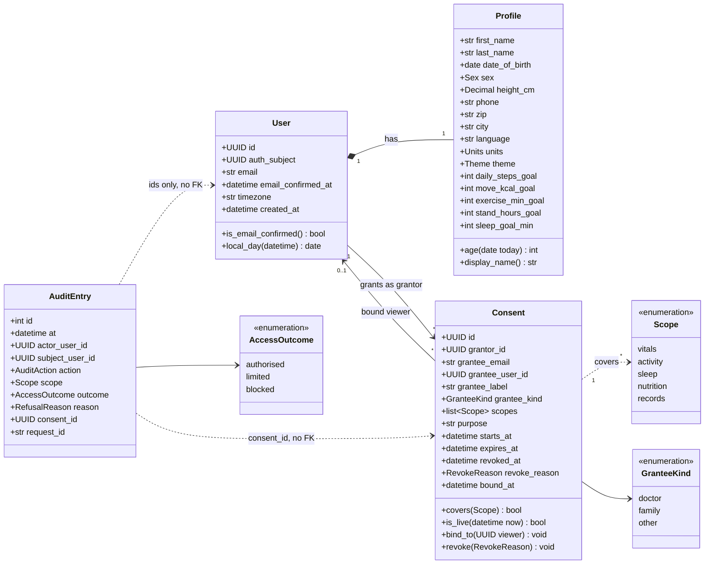
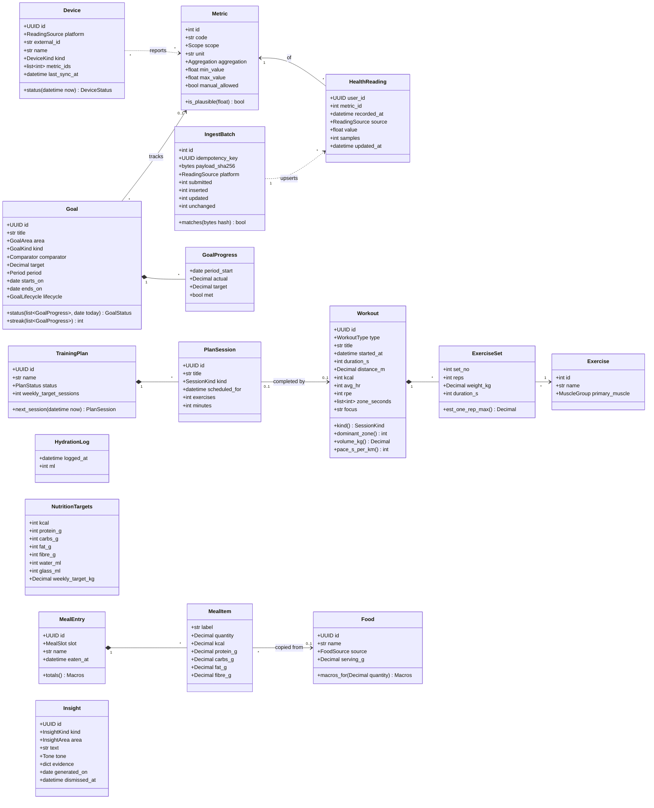
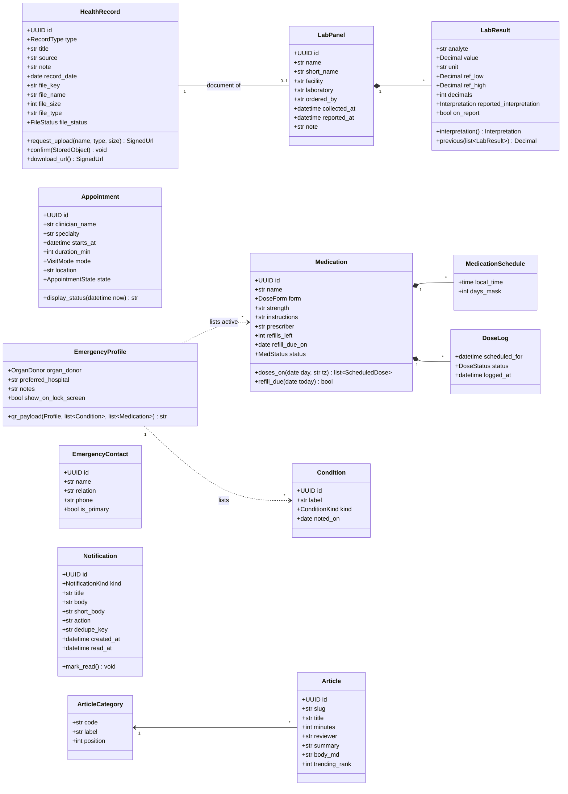
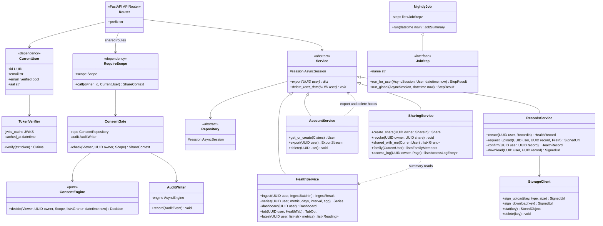

# 3. Class diagram

There are two views. The **domain model** shows the entities, their key attributes, behaviour and
relationships. It maps 1:1 to SQLAlchemy models, and the attributes match [the database](04-database.md).
The **service model** shows how routers, services, repositories and the core classes fit together.

Notation: `+` public, `-` private, `$` static, `*` abstract. Multiplicities are on the associations.
Computed values (status, streaks, totals) are methods, not stored attributes.

## 3.1 Account, sharing and audit

## 3.2 Health, training, nutrition and goals

Every class above also has `user_id` → `User`. It's left out to keep the diagram readable.

## 3.3 Records, care, notifications and library

`Article` and `ArticleCategory` are shared content with no `user_id`. Every other class belongs to
a user, and so does each `EmergencyContact`.

## 3.4 Service model

How to read it:

- A **router** depends on `CurrentUser` and on `RequireScope(scope)` for every `/users/{id}/…` route.
  `RequireScope` returns a `ShareContext` (owner id, consent id, scope). The service then reads only
  what that scope allows.
- **`ConsentEngine.decide`** is static and pure, with no I/O, so every rule has a unit test.
  **`ConsentGate`** does the I/O around it: it loads grants, binds the grant on first use, and calls
  `AuditWriter` in its own transaction before raising a refusal.
- Every module service implements **export and delete hooks**. `AccountService` calls them all for
  `GET /me/export` and `DELETE /me`.
- **`NightlyJob`** runs an ordered list of `JobStep`s. Per-user steps run in their own transaction:
  goal progress, insights, missed-dose notifications, overdue-device notifications. Global steps then
  close expired shares, delete stale uploads and notifications older than 90 days, and clear old
  ingest batches.
