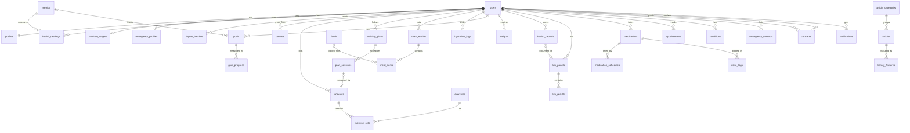
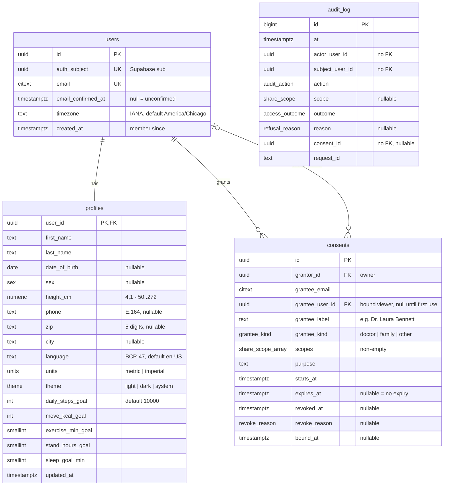
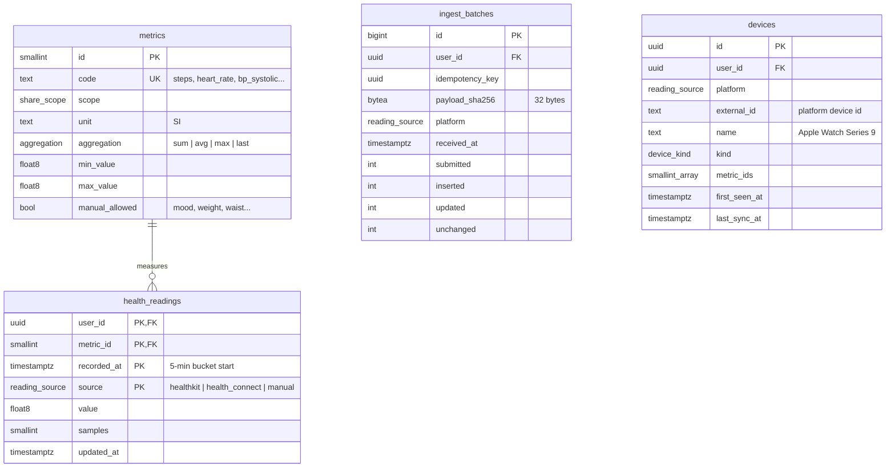
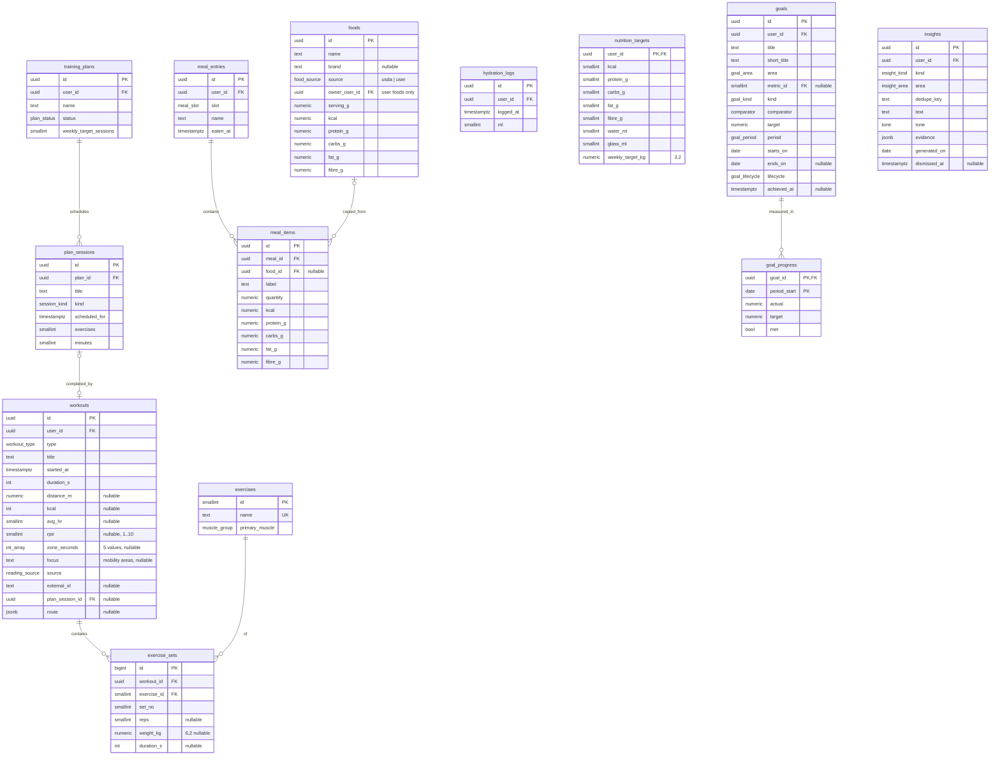
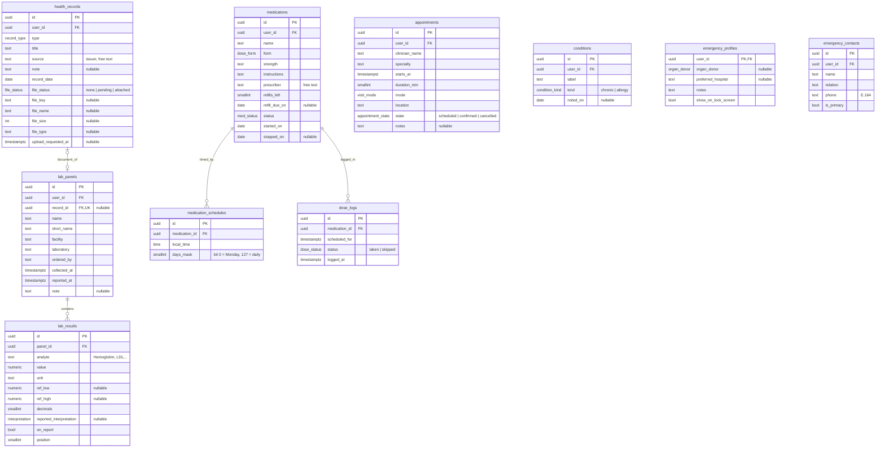
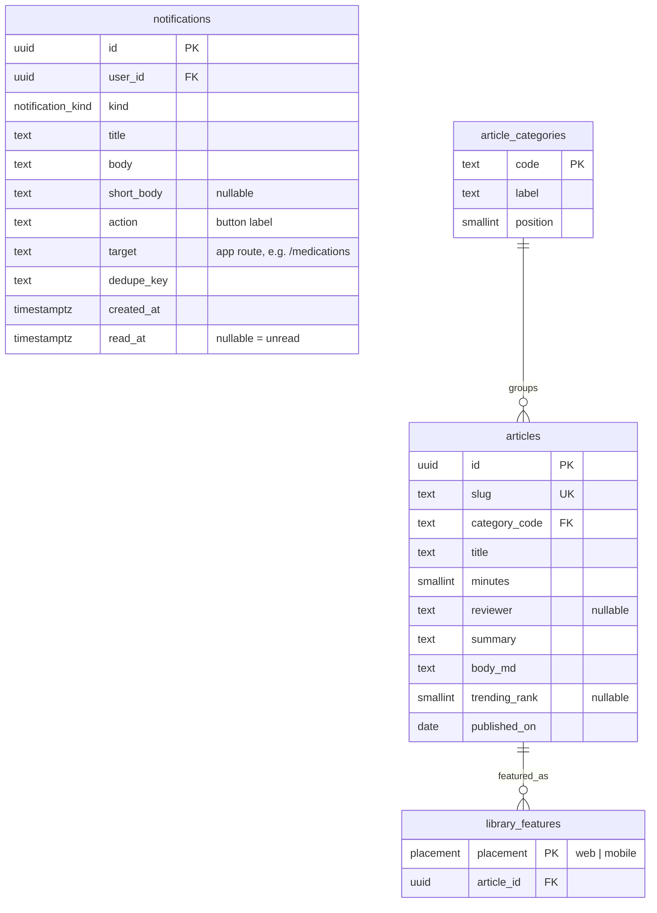

# 4. Database

One Supabase Postgres database with **35 tables** in a private schema, `vitallink`. The design doc
had 18. The new ones serve the screens built since then.

## 4.1 Schema-wide rules

| Rule | How it's enforced |
|---|---|
| Private schema, no direct access | `vitallink` is not an exposed schema; Data API off; RLS **on** with **no policies** on every table; `anon` and `authenticated` grants revoked (incl. default privileges). Only the API role connects. CI checks the live project ([security](06-security-and-consent.md)). |
| Ownership | Every user-owned table has `user_id uuid NOT NULL REFERENCES users(id) ON DELETE CASCADE` and an index that starts with `user_id`. Deleting a user deletes their data in one statement. |
| IDs | `uuid` UUIDv7, generated by the API, for every id a client sees. Internal-only tables use `bigint GENERATED ALWAYS AS IDENTITY`. |
| NOT NULL by default | A nullable column always has a stated meaning (e.g. `read_at` null = unread). |
| Closed sets | Postgres enums (list in 4.9). The metric catalogue is a lookup table because it carries a unit, scope and range. |
| Time | `timestamptz` (UTC). Calendar facts that have no instant (birth date, record date, goal period) are `date`. Medication times of day are `time` + the user's timezone. |
| Quantities | SI units. Measured quantities that are summed or compared exactly (macros, weights lifted, lab values) are `numeric(p,s)`. Sensor aggregates are `double precision`. |
| No soft delete | Hard deletes. Rows that stay visible but inactive use a lifecycle enum (`status`). |
| Timestamps | `created_at timestamptz NOT NULL DEFAULT now()` on every table; `updated_at` where rows change. |
| Every FK has an index | On the child side, in the same migration. |
| Migrations | Alembic only. CI runs `alembic upgrade head` on an empty DB and fails if models and migrations drift. |

## 4.2 Overview

`audit_log` is deliberately **not connected**. It keeps user and consent ids without foreign keys,
so it survives account deletion and can never be rewritten by a cascade.

## 4.3 Account and sharing

| Table | Invariants and constraints | Indexes | On delete |
|---|---|---|---|
| `users` | `auth_subject` unique (created with `INSERT … ON CONFLICT DO NOTHING`, so racing first requests both succeed); `email` unique, case-insensitive | PK, UKs | — (root) |
| `profiles` | 1:1 with users (PK = FK); `height_cm` 50–272; `zip ~ '^\d{5}$'`; `phone ~ '^\+[1-9]\d{6,14}$'`; goals > 0; `stand_hours_goal` 1–24 | PK | CASCADE from users |
| `consents` | `grantor_id <> grantee_user_id`; `cardinality(scopes) > 0`; `expires_at > starts_at`; `revoke_reason IS NOT NULL ⇔ revoked_at IS NOT NULL`; `bound_at IS NOT NULL ⇔ grantee_user_id IS NOT NULL` unless revoked. One live share per (grantor, grantee_email): partial unique index `WHERE revoked_at IS NULL`. | `(grantor_id)`, `(grantee_user_id)`, `(grantee_email) WHERE grantee_user_id IS NULL` | grantor: CASCADE. grantee_user_id: **RESTRICT**. Account deletion first revokes grants received (`revoke_reason = 'grantee_deleted'`) and clears the binding in the same transaction, so a later sign-up with that email can never inherit them. |
| `audit_log` | Append-only. A trigger raises on `UPDATE` and `DELETE`, and `TRUNCATE` is revoked. No free text: reasons are an enum, so nothing personal needs scrubbing after an account is deleted. | `(subject_user_id, at DESC)`, `(actor_user_id, at DESC)` | Never deleted |

Two things the Figma file has are left out on purpose. `grantee_kind` has no `hospital` (consumers
only) and no `app` (no third parties). See [D4](10-open-decisions.md).

## 4.4 Health

| Table | Invariants and constraints | Indexes | On delete |
|---|---|---|---|
| `metrics` | Seeded by migration; `min_value < max_value`. This is the closed catalogue, and every metric maps to exactly one scope. | `code` UK | RESTRICT (never deleted) |
| `health_readings` | **PK `(user_id, metric_id, recorded_at, source)`**, which is the de-dup key, so writes are `INSERT … ON CONFLICT DO UPDATE` (new value wins). `CHECK (extract(epoch FROM recorded_at)::bigint % 300 = 0)` so every row is a bucket start. `samples > 0`. The value's plausibility range is checked against `metrics` in the service (a CHECK can't read another table). No surrogate id and no per-row unit, to save space on the biggest table. | PK serves `(user, metric, time)` range scans | CASCADE |
| `ingest_batches` | UK `(user_id, idempotency_key)`; `octet_length(payload_sha256) = 32`; `inserted + updated + unchanged = submitted`; `submitted` 1–5000. Same key with a different hash → 409. Kept 30 days, which is the replay window. | UK; `(received_at)` for cleanup | CASCADE |
| `devices` | UK `(user_id, platform, external_id)`. Upserted from the `devices` list in each ingest batch, which also moves `last_sync_at` forward. "Overdue" is computed: no sync for 24 h, or 7 days for home monitors. | UK | CASCADE |

**Metric catalogue (seed).** Each metric belongs to exactly one scope:

| Scope | Metrics |
|---|---|
| vitals | `heart_rate`, `resting_heart_rate`, `hrv`, `bp_systolic`, `bp_diastolic`, `spo2`, `respiratory_rate`, `glucose`, `body_temperature`, `vo2_max`, `hr_high_event`, `hr_low_event`, `irregular_rhythm_event` |
| activity | `steps`, `distance`, `active_energy`, `basal_energy`, `exercise_minutes`, `stand_hours`, `flights_climbed`, `mindful_minutes`, `mood`, `stress`, `energy`, `screen_time`, `screen_time_social`, `screen_time_entertainment`, `screen_time_productivity`, `phone_pickups`, `notifications_received` |
| sleep | `sleep_asleep`, `sleep_deep`, `sleep_core`, `sleep_rem`, `sleep_awake` (minutes per bucket) |
| vitals (body) | `weight`, `body_fat`, `lean_mass`, `waist`, `hip`, `chest`, `arm`, `thigh` |

Blood pressure is stored as two metrics with the same `recorded_at` and paired by the series query.
That's simpler than a second value column on 288 rows/day/user.

## 4.5 Training, nutrition and goals

| Table | Invariants and constraints | Indexes | On delete |
|---|---|---|---|
| `exercises` | Seeded catalogue; name unique | UK | RESTRICT |
| `workouts` | `duration_s > 0`; `distance_m >= 0`; `kcal >= 0`; `avg_hr` 25–250; `rpe` 1–10; `zone_seconds` is null or has exactly 5 non-negative values; UK `(user_id, source, external_id)` where `external_id` is not null (synced workouts don't duplicate). Session kind (cardio / strength / mobility) is derived from `type`, not stored. | `(user_id, started_at DESC)`; UK; `(plan_session_id)` | CASCADE; plan_session SET NULL |
| `exercise_sets` | UK `(workout_id, exercise_id, set_no)`; `reps > 0`, `weight_kg >= 0`, `duration_s > 0`; `CHECK (reps IS NOT NULL OR duration_s IS NOT NULL)`. Personal records are computed from these rows (best weight; Epley one-rep max). | `(workout_id)`, `(exercise_id)` | CASCADE from workout; RESTRICT on exercise |
| `training_plans` | `weekly_target_sessions` 1–14; one active plan per user (partial UK `(user_id) WHERE status = 'active'`) | partial UK, `(user_id)` | CASCADE |
| `plan_sessions` | `exercises >= 0`, `minutes > 0` | `(plan_id, scheduled_for)` | CASCADE |
| `foods` | `source = 'user' ⇔ owner_user_id IS NOT NULL`; all macros `>= 0`; `serving_g > 0`. USDA FoodData Central subset seeded (public domain). Search uses `pg_trgm` (`gin (name gin_trgm_ops)`). | trigram GIN; `(owner_user_id)` | user foods CASCADE |
| `meal_entries` | — | `(user_id, eaten_at)` | CASCADE |
| `meal_items` | `quantity > 0`; macros `>= 0`. Macros are **copied at write time**, so editing or deleting a food never rewrites history. | `(meal_id)`, `(food_id)` | CASCADE from meal; food SET NULL |
| `hydration_logs` | `ml` 1–3000 | `(user_id, logged_at)` | CASCADE |
| `nutrition_targets` | 1:1 with users; values > 0; `weekly_target_kg` −1.00 to 1.00. Base burn is computed (Mifflin-St Jeor from profile + latest weight), not stored. | PK | CASCADE |
| `goals` | `target > 0`; `ends_on > starts_on`; `lifecycle = 'achieved' ⇔ achieved_at IS NOT NULL`; `kind IN ('daily_total','weekly_count') ⇒ metric_id IS NOT NULL`. Lifecycle is what the user set (active / paused / achieved / abandoned). The API's `on_track` / `at_risk` is computed from progress. | `(user_id, lifecycle)` | CASCADE; metric RESTRICT |
| `goal_progress` | PK `(goal_id, period_start)`, upserted nightly and on write. A streak is a scan of at most 90 rows. | PK | CASCADE |
| `insights` | UK `(user_id, kind, dedupe_key)`, so the nightly job replaces instead of piling up; `evidence` is free-form JSON (p-values, n, metric pair) | UK; `(user_id, generated_on DESC) WHERE dismissed_at IS NULL` | CASCADE |

## 4.6 Records and care

| Table | Invariants and constraints | Indexes | On delete |
|---|---|---|---|
| `health_records` | File columns all null when `file_status = 'none'`; `file_key` and `upload_requested_at` set when `pending`; all set when `attached`. `file_size` ≤ 25 MB; `file_type` in an allow-list (PDF, JPEG, PNG, HEIC). Stores a storage key, never a URL. | `(user_id, record_date DESC)`, `(user_id, type)`, `(file_status, upload_requested_at) WHERE file_status = 'pending'` | CASCADE; the service deletes the stored object, and the nightly job retries orphans |
| `lab_panels` | `reported_at >= collected_at`; `record_id` unique (one panel per document) | `(user_id, collected_at DESC)`, UK | CASCADE; record SET NULL |
| `lab_results` | UK `(panel_id, analyte)`; `ref_low < ref_high` when both set; `decimals` 0–4. `interpretation()` uses the lab's reported value when present, otherwise computes from the range (just outside = borderline). The "previous" value is the same analyte in the user's latest earlier panel. **Blood-group analytes (ABO, Rh) are rejected** by the service. | `(panel_id)` | CASCADE |
| `medications` | `refills_left >= 0`; `status = 'stopped' ⇔ stopped_on IS NOT NULL`; `stopped_on >= started_on` | `(user_id, status)` | CASCADE |
| `medication_schedules` | UK `(medication_id, local_time)`; `days_mask` 1–127 | UK | CASCADE |
| `dose_logs` | UK `(medication_id, scheduled_for)`, so logging the same dose twice updates it. The API's `due` and `missed` states are computed: no log + time passed + 2 h grace = missed. | UK | CASCADE |
| `appointments` | `duration_min > 0`. The API status maps from state and time: `scheduled` → pending, `confirmed` → confirmed, `cancelled` → cancelled, and a past non-cancelled appointment → completed. Users track their own visits; there is **no booking with a provider**. | `(user_id, starts_at)` | CASCADE |
| `conditions` | UK `(user_id, lower(label), kind)` | UK | CASCADE |
| `emergency_profiles` | 1:1 with users. Name, age, sex and city come from `profiles`; allergies and conditions from `conditions`; medications from active `medications`. | PK | CASCADE |
| `emergency_contacts` | `phone` E.164; at most one primary (partial UK `(user_id) WHERE is_primary`); at most 5 per user (service) | `(user_id)`, partial UK | CASCADE |

`organ_donor` (yes / no / undecided) stays because the Emergency frame shows it. It's an organ-donor
preference, not a blood feature ([D13](10-open-decisions.md)).

## 4.7 Notifications and library

| Table | Invariants and constraints | Indexes | On delete |
|---|---|---|---|
| `notifications` | UK `(user_id, dedupe_key)`, so a repeated event or a re-run nightly job never duplicates; deleted after 90 days | `(user_id, created_at DESC)`, `(user_id) WHERE read_at IS NULL` | CASCADE |
| `article_categories` | Seeded; no blood category (the Figma "Cat / Blood" layer is a leftover) | PK | RESTRICT |
| `articles` | `minutes > 0`; `trending_rank` unique when set. Content lives as Markdown in `seeds/library/` and is loaded by the seed script; there is no admin UI. `reviewer` is set only for a real, consenting reviewer ([D14](10-open-decisions.md)). | UK slug; `(category_code)` | RESTRICT on category |
| `library_features` | One featured article per placement | PK | CASCADE from article |

The library is the same for everyone and records **no per-user reads**. "Trending" is editorial
order, not tracking.

## 4.8 Capacity

| Table | Per active user | Note |
|---|---|---|
| `health_readings` | ~310 rows/day × ~120 B incl. index ≈ **37 KB/day, 13.5 MB/year** | Smaller than the design doc's 23 MB/year because there's no surrogate id and no per-row unit |
| Everything else | < 1 MB/year | Workouts, meals, doses, notifications (90-day retention) |
| Files (Storage) | 0.2–2 MB per document | 1 GB free ≈ several hundred documents |

The free 500 MB database holds about **30 user-years** after ~50 MB of seeds (foods, library) and
indexes. The capstone needs about 15 accounts × 6 months ≈ 100 MB.

## 4.9 Enums

| Enum | Values |
|---|---|
| `share_scope` | vitals, activity, sleep, nutrition, records |
| `grantee_kind` | doctor, family, other |
| `revoke_reason` | owner, expired_cleanup, grantee_deleted |
| `audit_action` | read, share_granted, share_revoked, share_bound |
| `access_outcome` | authorised, limited, blocked |
| `refusal_reason` | no_grant, scope_not_granted, revoked, not_yet_valid, expired, email_unconfirmed |
| `reading_source` | healthkit, health_connect, manual |
| `aggregation` | sum, avg, max, last |
| `device_kind` | phone, wearable, home_monitor, continuous |
| `sex` | female, male, other, undisclosed |
| `units` / `theme` | metric, imperial / light, dark, system |
| `workout_type` | walk, run, cycle, strength, swim, hiit, yoga, other |
| `session_kind` | cardio, strength, mobility |
| `muscle_group` | chest, back, shoulders, arms, core, legs, glutes, full_body |
| `plan_status` | active, archived |
| `food_source` / `meal_slot` | usda, user / breakfast, lunch, dinner, snack |
| `goal_area` | activity, fitness, nutrition, sleep, body, mind |
| `goal_kind` / `comparator` / `goal_period` | daily_total, weekly_count, target_value / at_least, at_most / day, week, month, none |
| `goal_lifecycle` | active, paused, achieved, abandoned |
| `insight_kind` / `insight_area` / `tone` | correlation, trend, milestone / overview, activity, sleep, heart, respiratory, body, mental, digital / positive, watch |
| `record_type` | lab, prescription, imaging, visit, vaccination, allergy, procedure, upload |
| `file_status` | none, pending, attached |
| `interpretation` | normal, borderline, abnormal |
| `dose_form` / `med_status` / `dose_status` | tablet, capsule, liquid, inhaler, injection, topical, other / active, stopped / taken, skipped |
| `visit_mode` / `appointment_state` | in_person, telehealth / scheduled, confirmed, cancelled |
| `condition_kind` / `organ_donor` | chronic, allergy / yes, no, undecided |
| `notification_kind` | fitness, health, medication, appointments, records, security, goals |
| `placement` | web, mobile |

Adding an enum value is a forward-only migration (`ALTER TYPE … ADD VALUE`). Removing one means
creating a new type, so values are added only when a screen needs them.
