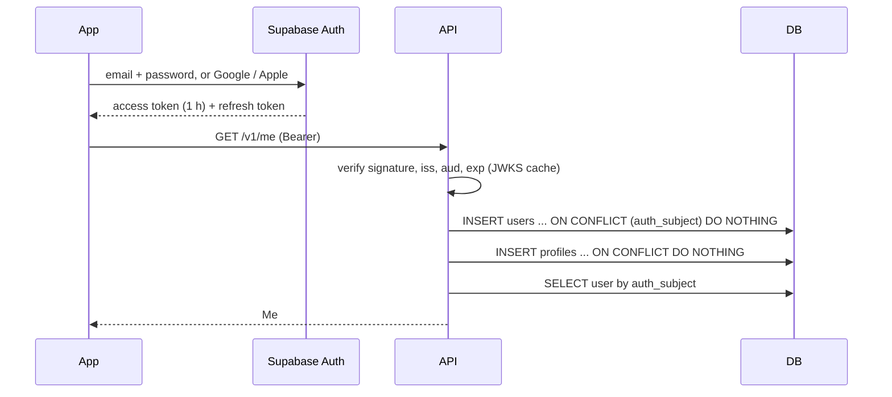
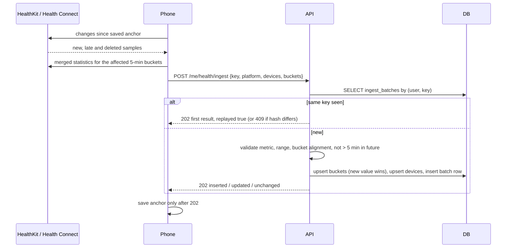
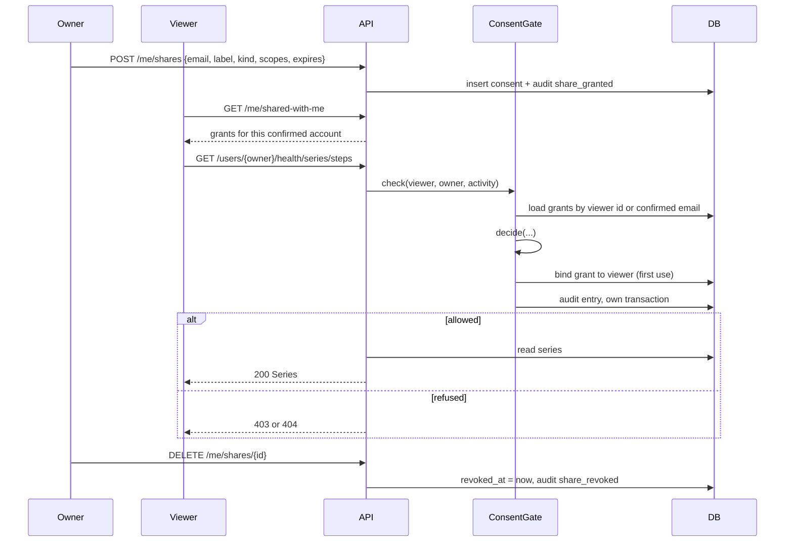
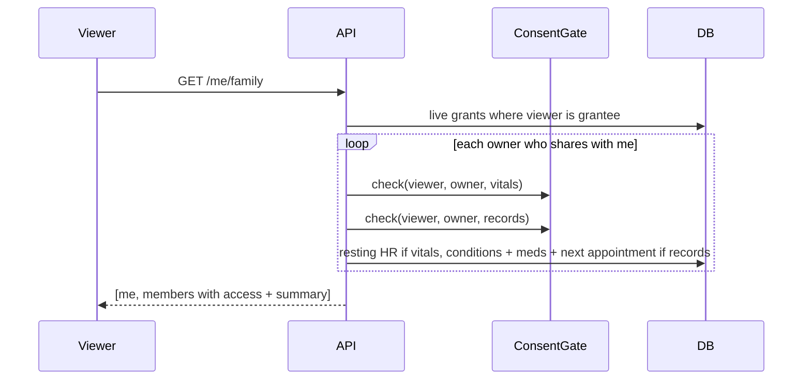
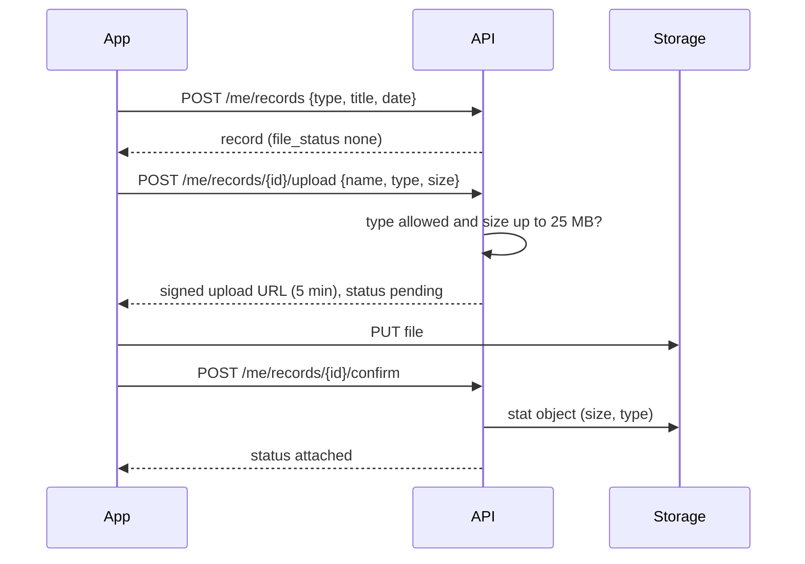
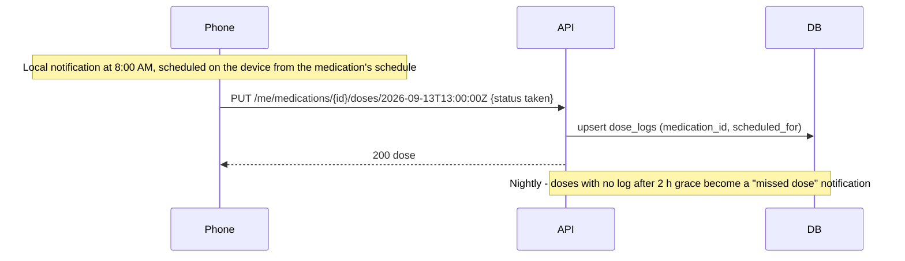
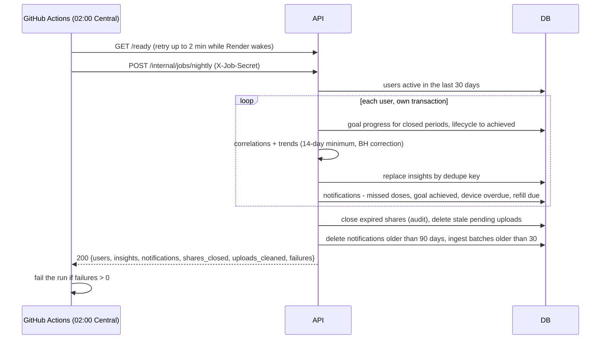

# 7. Key flows

## 7.1 Sign-in and first request

The app fires several requests at once on first launch. Insert-if-absent lets them all succeed.
The API never sees a password.

## 7.2 Device sync (phone only)

- **Merged statistics, not raw samples.** iPhone + Watch both count the same steps. HealthKit
  statistics queries and Health Connect aggregate reads merge sources, so nothing doubles.
- **Upsert, don't skip.** Late watch data and user deletions change a bucket that was already sent.
  The new value replaces the old one.
- **Anchor after success.** A failed upload retries with the same key. More than 5,000 buckets → 413,
  and the phone splits the batch.
- **Workouts** sync through `POST /me/workouts` with `source` + `external_id`, so a re-sync updates
  the workout instead of duplicating it.

## 7.3 Sharing and a shared read

Revocation applies on the viewer's next request, because nothing is cached between requests.

## 7.4 Family view

Each family card is a real read of someone's data, so it gets an access-log entry
(`authorised` or `limited`). That's intended. Unlike the removed "access check" endpoint, each read
here returns data.

## 7.5 Document upload

Uploads still pending after 24 h are deleted by the nightly job. Downloads are signed for 5 minutes.

## 7.6 Taking a dose

The phone re-schedules local notifications whenever `GET /me/medications` or
`GET /me/appointments` returns something new. Reminders need no server push and work offline.

## 7.7 Nightly job

Every step is safe to run twice: progress is upserted, insights and notifications have dedupe keys,
and cleanup is idempotent.
