# 8. Operations and testing

## 8.1 Environments

| Environment | Runs on | Database | Auth | Purpose |
|---|---|---|---|---|
| Local | `docker compose up` (API + Postgres 16 + MinIO for storage) | Container, seeded demo user | Dev tokens (`ENV=local` only) | Day-to-day work |
| CI | GitHub Actions runner | Postgres service container | Dev tokens | Every pull request |
| Production | Render free web service, Virginia | Supabase free, us-east-1, session pooler :5432 | Supabase Auth, email confirmation on | Demo and real use |

One Docker image serves every environment. Only environment variables differ.

## 8.2 Configuration (`.env.example` will document every key)

| Setting | Where |
|---|---|
| `DATABASE_URL`, `SUPABASE_URL`, `SUPABASE_JWKS_URL`, `SUPABASE_SERVICE_KEY`, `STORAGE_BUCKET` | Render secrets |
| `JOB_SECRET` | Render + GitHub Actions secrets (same value) |
| `BACKUP_PASSPHRASE` | GitHub Actions secret only |
| `CORS_ORIGIN`, `ENV`, batch limits, link lifetimes, rate limits | Plain env vars with safe defaults |

## 8.3 Delivery pipeline

```mermaid
flowchart LR
  PR[Pull request] --> L[ruff + mypy + import-linter]
  L --> T[pytest on real Postgres]
  T --> G[Guardrail tests]
  G --> D[Alembic drift check]
  D --> M[Review + merge to main]
  M --> B[Render builds image]
  B --> MG[alembic upgrade head]
  MG --> H["/ready passes"]
  H --> LIVE[Live]
```

Any failure stops the pipeline. Render keeps the previous version serving until the new one is
healthy, and rolling back is one click. Migrations follow expand → migrate → contract, so the old
version keeps working while the new one deploys.

`npm run typecheck` in the root also runs against `packages/api` whenever `types.ts` changes, so
contract drift shows up on the frontend side too. A later step generates `types.ts` from `/openapi.json`.

## 8.4 Scheduled workflows (GitHub Actions)

| Workflow | Schedule | Does |
|---|---|---|
| `nightly.yml` | 07:00 UTC (≈ 02:00 Central) | Wake `/ready`, then `POST /internal/jobs/nightly`; fails red on any per-user failure |
| `backup.yml` | weekly | `pg_dump` → `age`-encrypted → workflow artifact kept 90 days. **Repo must be private** |
| `deploy-check.yml` | on merge + daily | The lockdown checks in 6.2 against the live project |

Keepalive is **not** a GitHub workflow. Each run bills at least one minute, and pinging every 10 minutes
would use about 3,000 of a private repo's 2,000 free minutes a month. A free external monitor
(UptimeRobot or similar) calls `GET /ready` every 10 minutes from 12:00 to 05:00 UTC instead. That
keeps Render awake in Dallas daytime and keeps the Supabase project active.

## 8.5 Observability

- **Logs.** One JSON line per request: request id, route template, status, duration, user id. Never
  bodies. Render keeps and searches them.
- **Request ids** go in a response header and every error body, so a screenshot of an error leads to
  its log line.
- **Watch:** error rate, requests > 1 s, DB size against 500 MB, refused-access counts per user (a
  spike means probing), and nightly job failures.

## 8.6 Free-tier limits and how we stay inside them

| Limit | Our load | Verdict |
|---|---|---|
| Render 512 MB RAM, sleeps after 15 min | App ~150 MB + SciPy ~80 MB | Fits; keepalive ping |
| Render 750 instance-hours/month | Awake ~17 h/day ≈ 520 h | Fits; the keepalive window leaves the night to sleep |
| Supabase 500 MB DB | ~13.5 MB per user-year | ~30 user-years |
| Supabase 1 GB storage, 5 GB egress | Lab PDFs 0.2–2 MB; dashboard ~5 KB | Fine |
| Supabase pauses after 7 days inactive | Keepalive hits the DB through `/ready` | Fine |
| GitHub Actions minutes (private repo: 2,000/month) | Nightly ~2 min + backup ~3 min + CI ~5 min per PR | Fine. Keepalive runs outside Actions (8.4) |

## 8.7 Testing strategy

Tests run against **real Postgres**, because the guarantees that matter (upsert de-dup, cascades,
the append-only trigger, check constraints) live in the database.

| Level | Covers | Examples |
|---|---|---|
| Unit (pure) | `decide()`, readiness score, streaks, goal status, insight statistics, interpretation, dose state, BMR | Expiry is exclusive; vitals grant never opens records; unconfirmed email matches nothing; random noise yields no insight; DST day has 23 h of buckets |
| Integration | Each service + repository against Postgres | Re-sent bucket overwrites; same key + new payload → 409; parallel first requests both succeed; edited food leaves old meals unchanged; one active plan per user |
| API | Full HTTP through the app (httpx) | Grant → read → revoke → refused; refusal appears in the owner's access log; pending upload never downloadable; another user's id on `/me/...` → 404 |
| Contract | Responses vs `packages/api` | Each endpoint's JSON validated against the TypeScript shape (via the generated JSON Schema) |
| Guardrails | The codebase itself | 6.6 list |
| Deployment | The live Supabase project | No exposed tables; RLS on; no anon grants; bucket private |
| Migrations | Schema history | Upgrade from empty; no drift; downgrade of the last migration |
| Manual | What automation can't judge | iPhone + Watch steps don't double; late watch data corrects a bucket; Android Health Connect; cold start; the demo script |

**Seed data.** `seeds/demo.py` creates a demo account with 90 days of realistic data. The Figma
sample values are the anchor, so a live demo looks like the designs. The data has a planted
screen-time → lower deep-sleep pattern, so the insight engine finds something real.

**Gate.** Nothing merges unless lint, types, tests, guardrails and the drift check pass. Every
consent rule has at least one test.
