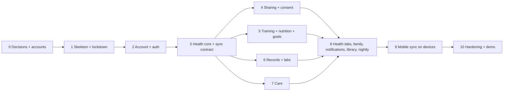

# 9. Build plan

Ten phases. Each one ends with something deployed and demoable, and each turns some of the
frontend's `pending()` calls into live endpoints. Phases 0–3 must go in order. After phase 3 the
domain phases (4–8) can run in parallel across the team.

Size: **S** ≈ 2–3 days, **M** ≈ 1 week, **L** ≈ 2 weeks for one or two people.

## Phase 0: Decisions and accounts (S)

- Owner decides D1–D16 in [open decisions](10-open-decisions.md). At minimum D1–D4 and D9 must be
  settled before phases 4 and 7.
- Create the shared **group** accounts (not one person's): Supabase project (us-east-1), Render, and
  the GitHub organisation or the private repo's secrets.
- Supabase settings recorded in `backend/infra/supabase.md`: Data API off, email confirmation on,
  TOTP MFA on, private bucket (25 MB, MIME allow-list).

**Exit:** decisions written into CLAUDE.md, accounts exist, secrets stored.

## Phase 1: Skeleton and lockdown (M)

- `pyproject.toml` (uv), FastAPI app, `core/settings`, `core/db`, `core/errors`, request id
  middleware, JSON logging, `/health`, `/ready`.
- Docker image, `docker-compose.yml` (API + Postgres + MinIO), `.env.example`.
- Alembic baseline: the `vitallink` schema, all enums, `REVOKE` grants, the RLS-on helper, the
  `audit_log` table and its append-only trigger.
- CI: ruff, mypy, import-linter, pytest with a Postgres service, drift check.
- Render service + `deploy-check.yml` (lockdown checks against the live project).

**Exit:** `/ready` is green on Render, the deploy check passes, and an empty PR runs the full pipeline.

## Phase 2: Account and auth (S)

- `core/security` (JWKS verify, dev tokens for local), `CurrentUser` dependency, rate limiter.
- `users`, `profiles`; `GET /me` (insert-if-absent), `GET/PATCH /me/account`, `GET/PATCH /me/targets`.
- Export and delete skeleton, with the hook interface each module implements later.
- Web and mobile: replace the sign-in stubs with Supabase Auth; set `VITE_API_URL` / `EXPO_PUBLIC_API_URL`.

**Goes live:** `me()`, `account()`.
**Exit:** sign up → confirm email → sign in on web and mobile → Settings shows the real profile.

## Phase 3: Health core and sync contract (L)

- `metrics` seed (the catalogue), `health_readings`, `ingest_batches`, `devices`.
- `POST /me/health/ingest` with idempotency, validation and upsert. `POST /me/health/manual`.
- Series and summary queries (timezone-aware `date_trunc`), dashboard + readiness score,
  `GET /me/health/latest`, `GET /me/devices`.
- `seeds/demo.py`: 90 days of data that reproduces the Figma numbers.
- **Freeze the ingest contract** (request/response JSON Schema in `docs/`). Phase 9 builds against it.

**Goes live:** `dashboard()`, `series()`, `bloodPressure()`, `bloodPressureLatest()`, `devices()`.
**Exit:** the demo user's dashboard and Activity tab render live; ingest replays and late corrections are tested.

## Phase 4: Sharing and consent (M)

- `core/consent` (`decide` + `ConsentGate`), `core/audit` (own transaction), `consents`.
- Shares CRUD, `shared-with-me`, access log, `GET /me/privacy`.
- Shared views for health (`/users/{id}/health/...`). Guardrail test for `require_scope`.
- Account delete: revoke received grants.

**Goes live:** `shares()`, `accessLog()`, `privacySettings()`.
**Exit:** two real accounts. Grant → read → revoke → refused, all visible in the owner's access log. Every consent rule has a test.

## Phase 5: Training, nutrition and goals (L, splits across two people)

- Training: `exercises` seed, workouts + sets, plans + sessions, `GET /me/training`, records.
- Nutrition: USDA subset seed + trigram search, meals, hydration, targets, `GET /me/nutrition/day`.
- Goals: goals, `goal_progress` (computed on write and nightly), status, streaks, `GET /me/goals/overview`.
- Shared views: `/users/{id}/workouts`, `/training`, `/nutrition/day`.

**Goes live:** `workouts()`, `training()`, `nutrition()`, `goals()`, `goalsOverview()`, `streaks()`.

## Phase 6: Records and labs (M)

- `core/storage`, records CRUD, upload → confirm → download, `GET /me/records/overview`.
- Lab panels + results (manual entry per D6), previous value, interpretation, latest result.
- Shared views for records and labs.

**Goes live:** `recordsOverview()`, `labPanels()`, `latestLab()` (reshaped to `LabResult`).

## Phase 7: Care (M)

- Medications + schedules + dose log, `GET /me/medications`, `/today`, dose `PUT`.
- Appointments, conditions, emergency profile + contacts.
- Mobile: local notifications for doses and appointments (Expo Notifications, no server push).

**Goes live:** `medications()`, `medicationsOverview()`, `appointments()`, `nextAppointment()` (reshaped), `emergencyProfile()`.

## Phase 8: Health tabs, family, notifications, library, nightly job (L)

- `GET /me/health/overview` and the seven tab endpoints.
- `GET /me/family` and `/users/{id}/summary`.
- Notifications feed + generation; library seed (Markdown) + endpoints.
- `core/jobs` + nightly steps (progress, insights, missed doses, overdue devices, refills, share
  expiry, cleanup) + `nightly.yml` and `backup.yml`.

**Goes live:** `healthOverview()`, `vitals()` … `digital()`, `family()`, `notifications()`, `library()`.
After this phase every `pending()` call except `conversations()` is live.

## Phase 9: Mobile sync on real devices (L)

- Expo **development build** (HealthKit and Health Connect need native modules, so Expo Go can't do it).
- iOS: HealthKit anchored queries + `HKStatisticsCollectionQuery` per metric → 5-min buckets.
  Android: Health Connect changes token + aggregate reads → 5-min buckets. Android digital
  wellbeing from `UsageStatsManager`.
- Background delivery where the OS allows it. Upload on app open otherwise.

**Exit:** the manual test list in [8.7](08-operations-and-testing.md) passes on one iPhone + Watch and one Android phone.

## Phase 10: Hardening and demo (M)

- Run the backend-design reviews (schema, security, incident thinking) and fix what they find.
- Load test ingest (5,000 buckets < 2 s) and the dashboard (p95 < 300 ms warm).
- Restore drill from the encrypted backup.
- Generate `packages/api/src/types.ts` from OpenAPI; delete the contract tests that duplicate it.
- Demo script; open the app 5 minutes before presenting (cold start).

## Definition of done (every endpoint)

1. Pydantic in/out models match `types.ts`. The contract test passes.
2. Owner-only queries filter by the token's user id. Shared routes declare a scope.
3. Constraints and indexes are in the same migration as the table.
4. Unit tests for rules, integration tests for queries, one API test for the happy path and one for refusal.
5. Export and delete hooks updated.
6. The frontend `pending()` call is switched to `get()`, and the screen is checked live against the
   Figma screenshot.
